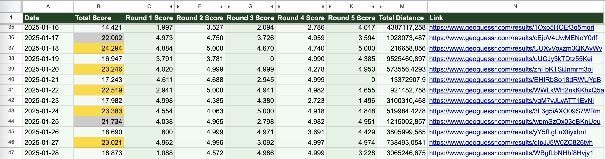

# GeoGuessr Daily Challenge Tracker

A simple Python script to track your GeoGuessr daily challenge scores and save them to a CSV file.

## Features

- Fetches your daily challenge results from GeoGuessr
- Saves scores and distances for each round
- Stores results in a CSV file with links to each game
- Prevents duplicate entries for the same day

## Requirements

- Python 3.10+
- GeoGuessr account cookie
- (Optional) Google Service Account credentials for Google Sheets integration

## Installation

1. Clone this repository
2. Install dependencies:
```bash
pip install -r requirements.txt
```

## Usage

1. Set required environment variables:
```bash
export NCFA_COOKIE="your_cookie_value_here"

# Optional: For Google Sheets integration
export USE_GSHEETS="true"
export GSHEET_ID="your_spreadsheet_id"
export GSHEET_CREDENTIALS="path/to/service-account.json"
```

2. Run the script:
```bash
python daily_challenge_tracker.py
```

The script will create a CSV file named `daily_challenges.csv` in the current directory with your game results.
If Google Sheets integration is enabled, it will also append the data to your spreadsheet.

### CSV Format

The CSV file contains the following columns:
- date: The date of the challenge
- total_score: Your total score for the game
- total_distance: Total distance in meters
- round[1-5]_score: Score for each round
- round[1-5]_distance: Distance in meters for each round
- link: Direct link to the game results

### Google Sheets Setup (optional)



1. Create a Google Cloud Project
2. Enable Google Sheets API
3. Create a Service Account with no roles
4. Download the service account key
5. Share your Google Sheet with the service account email (with Editor permissions)
6. Copy the Spreadsheet ID from the URL


# TODO
- [x] Add more formatting to the sheet
- [x] Add a feature to reingest past results
- [ ] Add simple graph with results stats
- [ ] Automate getting previous_daily_links
- [ ] Add tests 😅
